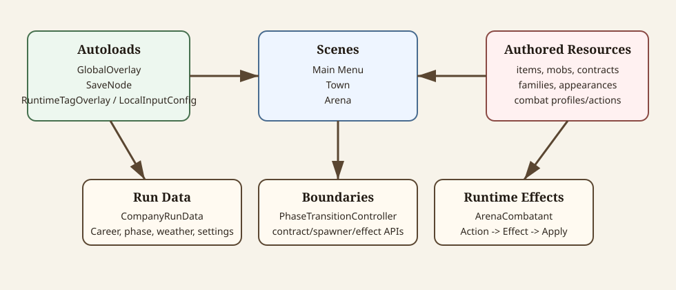

# Architecture

This document records durable implementation boundaries. It should explain how systems connect without becoming an authoring guide, changelog, or roadmap.



<details>
<summary>Diagram source notes</summary>

The SVG at [architecture-overview.svg](diagrams/architecture-overview.svg) shows autoloads, scenes, authored resources, run data, runtime boundaries, and arena effects as separate ownership areas.

</details>

## Core Rule

Scenes present and coordinate. Resources store data and own game-state mutation APIs. Autoloads provide global runtime services. Authored `.tres` files are data, not hardcoded logic.

## Autoloads

| Autoload | Responsibility |
| --- | --- |
| `GlobalOverlay` | Single path for modal overlays, blurred popups, confirmation popups, focus handoff, and overlay cleanup. |
| `SaveNode` | Runtime holder and persistence boundary for company, run, career, phase, weather, settings, and history resources. |
| `RuntimeTagOverlay` | Displays `Demo`, `Dev`, and `(debug build)` runtime tags when enabled. |
| `LocalInputConfig` | Per-arena-launch local controller setup rows and controller assignment source of truth. |

Do not add new scene-local overlay managers or separate save holders unless there is a concrete need.

## Scene Ownership

Main scenes:

| Scene | Owns |
| --- | --- |
| `scenes/main_menu.tscn` | Company creation/loading entry, records/codex/settings entry points, transition to town. |
| `scenes/town.tscn` | Town presentation, building interactions, roster yard, contract launch setup, phase UI. |
| `scenes/arena.tscn` | Arena startup, spawners, runtime combat coordination, victory/defeat/forfeit resolution. |

Scenes should wire existing nodes, connect signals, call resource APIs, and transition between scenes. They should not become long-term data stores.

## Resource Ownership

Resource scripts under `scripts/resources/` own persistent data shape and most game-state mutation methods.

Important examples:

| Resource | Owns |
| --- | --- |
| `CompanyRunData` | Current mutable run state: gold, fame, roster, cemetery, inventory, market, assignments, active contract, tutorial flags. |
| `CompanyCareerData` | Lifetime additive totals for the current company. |
| `TownPhaseState` | Current day, Day/Night phase, champion cadence helpers. |
| `WeatherState` | Current shared weather across town, arena, save/load. |
| `SettingsConfig` | Runtime/user settings such as dev mode, demo mode, tutorial skip, low-health warning, deadzone. |
| `ArenaContractData` | Contract display, family data, resolved mob list, reward calculations. |
| `ArenaCombatState` | Runtime combat health, armor, status values, damage/heal/death signals. |

## Save Boundary

`SaveNode` loads and saves resources under `user://save`. It should remain the persistence boundary, not the place for general gameplay mutation helpers.

Gameplay systems should call domain APIs on `CompanyRunData`, `CompanyCareerData`, `TownPhaseState`, `WeatherState`, and contract/result helpers, then save through `SaveNode` when appropriate.

See [save-data.md](save-data.md) for detailed persistence behavior.

## Phase Boundary

Phase advancement goes through `PhaseTransitionController`:

- `CompleteArenaContract` for real arena returns.
- `CompleteArenaDay` for generic/debug Day -> Night.
- `SkipArenaContract` for skipping allowed non-champion days.
- `AdvanceToNextDay` for Night -> Day.

Phase work includes recovery, treatment, training, salaries, market refresh, weather randomization, champion cadence, arena assignment cleanup, and fight exhaustion.

## Contract And Spawner Boundary

Town selects a contract and assigns gladiators/controls before loading arena.

Arena startup reads:

- `CompanyRunData.ActiveArenaContract`
- `CompanyRunData.TownAssignments.ArenaGladiators`
- `CompanyRunData.ArenaControlAssignments`

`ArenaEnemySpawner` accepts an array of `EnemyMobData` and does not know about contract UI. `ArenaPlayerSpawner` reads assigned run data and control assignments.

## Combat Boundary

Combat actions are data-driven:

```text
Item or future mob data
  -> ArenaCombatActionData
  -> ArenaCombatEffectData subtype
  -> reusable effect .tscn executor
  -> ArenaCombatant.ApplyDamage / ApplyStatusEffect / AddExternalForce
```

Effect scenes should not mutate `GladiatorData`, `EnemyMobData`, `CompanyRunData`, contract rewards, or save data directly. Arena-level result systems own death cleanup, rewards, victory, defeat, and transitions.

See [arena-combat.md](arena-combat.md) and [arena-combat-actions.md](arena-combat-actions.md) for runtime combat details.

## UI Boundary

Modal overlays should go through `GlobalOverlay`.

Town building UI should use overlays unless a full dedicated scene is deliberately added. Dedicated Recovery Bay and Training Hall scenes are roadmap work, not current MVP architecture.

Reusable components belong under `scenes/components/`; one-off overlay screens belong under `scenes/ui/` or `scenes/town_overlays/` based on scope.

## Input Boundary

Local arena control assignment is explicit per contract launch through `LocalInputConfig` and `ArenaControlConfigOverlay`.

Keyboard, mouse, and gamepad combat input are implemented in `PlayerCombatant`. Touch can join setup but does not control arena combat yet.

Long-term multiplayer and input-only clients must stay host-authoritative. See [input.md](input.md) and [roadmap.md](roadmap.md).
