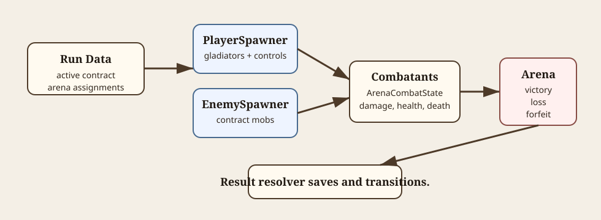

# Arena Combat

This document owns the arena scene runtime, spawners, combatants, player input, HUD, and result flow. Resource-driven action/effect architecture is documented separately in [arena-combat-actions.md](arena-combat-actions.md).

Diagram source notes

The SVG at [arena-combat-flow.svg](diagrams/arena-combat-flow.svg) shows town-selected run data feeding player/enemy spawners, combatants owning runtime combat state, and arena result flow resolving back to town or main menu.

## Scene Structure

`scenes/arena.tscn` uses a neutral root with world nodes and controller/UI nodes.

Important runtime nodes:

| Node/component | Purpose |
| --- | --- |
| `EnvironmentOverlay` | Shared phase/weather visuals. |
| `CombatHud` | Player combat status display. |
| `World/PlayerSpawner` | Spawns assigned player combatants from run data. |
| `World/EnemySpawner` | Spawns contract enemy mobs. |
| `ControllerUi/StatusPanel` | Dev-only win/loss buttons when dev mode is enabled. |

## Startup Data

Arena expects town launch flow to prepare:

- `CompanyRunData.ActiveArenaContract`
- `CompanyRunData.TownAssignments.ArenaGladiators`
- `CompanyRunData.ArenaControlAssignments`

Direct scene loads without those resources are useful for load checks but are not full valid contract runs.

## Player Spawning

`ArenaPlayerSpawner` spawns `PlayerCombatant` scenes from assigned arena gladiators. Each player receives its `GladiatorData` and matching `ArenaControlAssignmentData`.

`PlayerCombatant` configures runtime health from the gladiator's arena-entry health. This prevents arena healing from restoring pre-existing injuries above the amount the gladiator started the fight with.

Runtime player health changes sync back into `GladiatorData`.

## Enemy Spawning

`ArenaEnemySpawner` accepts typed `EnemyMobData` resources from `ArenaContractData.GetEnemyMobs()`.

If `EnemyMobData.Scene` is null, the generic `EnemyCombatant.tscn` fallback is used. If it is set, the scene should be an `EnemyCombatant`-rooted behavior-composition scene.

Enemy AI and family-specific behavior scenes are not implemented yet.

## Combatants

`ArenaCombatant` is the shared shell for players and enemies.

It owns:

- team identity
- runtime combat state
- damage/status/force entry points
- soft combatant separation
- look direction
- runtime state transitions

`ArenaCombatState` owns runtime health, armor, status values, damage/heal APIs, and death signals.

Combat damage and status details live in [damage-types.md](damage-types.md) and [status-effects.md](status-effects.md).

## Player Input

Implemented arena combat input:

| Control kind | Current behavior |
| --- | --- |
| Keyboard | WASD/arrows move and face, `Space` main-hand, `E` off-hand, `F` ability input, `Q` block input. |
| Mouse | Keyboard movement, mouse position aim, mouse left main-hand, mouse right off-hand, `Q` ability input, `Space` block input. |
| Gamepad | Left stick/D-pad move, right stick aim, `X` main-hand, `A` off-hand, `B` ability input, `Y` block input. |
| Touch | Can join launch setup, but arena gameplay input is not implemented yet. |

Main-hand and off-hand activation use item-authored `DamageItemData.MainAction`. Empty hand slots fall back to hidden punch resources under `resources/combat/player_defaults/`.

Block input currently enters a simple `Blocking` state while held if the player is idle. Blocking does not activate an authored action yet, but incoming damage resolves through `ArenaCombatState` with normal armor plus equipped hand-item `BlockArmorProfile` values. Ability input is still read/logged but does not activate authored gameplay actions.

Independent aim remains optional. Keyboard-only and movement-only control use movement direction as facing/aim direction.

## Actions And Effects

Player item actions flow through `ArenaCombatActionRunner` and reusable effect scenes.

See [arena-combat-actions.md](arena-combat-actions.md) for:

- `ArenaCombatActionData`
- `ArenaCombatEffectData`
- melee, linear projectile, thrown projectile, AOE executors
- buildup
- chaining
- attack sandbox workflow

## Victory, Defeat, And Forfeit

Arena result flow is centralized in `Arena.cs` and `ArenaContractResultResolver`.

Current behavior:

- all spawned enemies dead requests victory
- dev win button requests victory when dev mode is enabled
- victory waits 3 seconds, prevents player death, snapshots runtime health, shows rewards, then resolves win
- all spawned players dead resolves defeat
- champion loss force-retires the company and returns to main menu
- non-champion loss/forfeit kills only arena gladiators already at 0 health, completes arena day, saves, and returns to town
- first champion win in demo mode marks demo complete and returns to main menu after popup

## Current Limits

- Enemy AI and enemy-authored attacks are not implemented yet.
- Touch combat input is not implemented yet.
- Ability and dodge gameplay activation are not implemented yet. Block has only a simple held defense state; authored block actions/skills are not implemented yet.
- Projectile wall collision/bounce/break behavior is not implemented yet.
- Combat HUD is first-pass and should expand as combat feedback grows.
