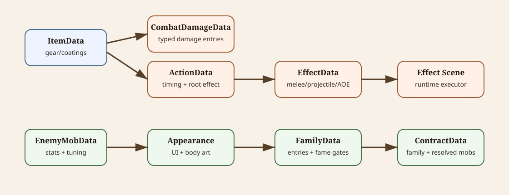

# Authoring Attacks

This document explains how to structure resource-driven arena attacks for items, tests, and future enemy behavior.



<details>
<summary>Diagram source notes</summary>

The SVG at [authoring-resource-model.svg](diagrams/authoring-resource-model.svg) shows the shared authored resource model: items point to damage/actions, actions point to effects, mobs point to appearance/tuning, families point to mobs, and contracts point to families and resolved mobs.

</details>

## Fast Path

To create a new attack:

1. Pick one root effect type: melee, linear projectile, thrown projectile, or area of effect.
2. Create an `ArenaCombatActionData` resource or subresource.
3. Set `Effect` to the matching typed effect resource.
4. Set the effect `ScenePath` to the matching runtime `.tscn`.
5. Add `ArenaCombatApplyData` if the effect should damage, push, or apply status.
6. Test the action in `tests/attack_effect_sandbox.tscn` before wiring it into an item.

The common structure is:

```text
Action
  -> Effect type and scene
      -> Apply payload
      -> optional chained followup effects
```

## Source Files

- Attack test resources live in `tests/attacks/`.
- Player item resources live in `resources/items/`.
- Attack action data lives in `scripts/resources/combat/actions/`.
- Attack effect data lives in `scripts/resources/combat/effects/`.
- Reusable runtime effect scenes live in `scenes/components/arena/combat/effects/`.
- Attack type icons live in `assets/ui/attacks/`.

Use `tests/attacks/*.tres` for isolated examples and existing items such as `resources/items/main_hand/training_sword.tres` for item-integrated examples.

## Minimum Valid Attack

A minimum useful attack has:

```text
ArenaCombatActionData
  DisplayName
  Effect

Effect subtype
  ScenePath
  Apply if it should hit targets
```

An effect with no `Apply` can still be valid if it only spawns a followup through `OnHitEffect` or `OnExpireEffect`.

## Resource Graph

An attack starts with `ArenaCombatActionData`.

```text
ArenaCombatActionData
  DisplayName
  Effect
  Buildup
  WindupSeconds
  StaminaCost
  SpawnDistance
  MaxChainDepth
```

`Effect` points to a typed `ArenaCombatEffectData` resource.

```text
ArenaCombatActionData
  -> ArenaCombatEffectData subtype
       -> reusable .tscn executor
       -> ArenaCombatApplyData
       -> optional OnHitEffect
       -> optional OnExpireEffect
```

Runtime spawning is handled by `ArenaCombatActionRunner`, which creates the effect scene and initializes it with `ArenaCombatEffectContext`.

Typed effect resources inherit shared fields from `ArenaCombatEffectData`, so the Godot inspector may show fields that a specific executor does not currently use. The sections below call out the fields that matter most for each executor.

## Action Fields

- `DisplayName`: Player/debug label for the action.
- `Effect`: The root effect spawned when the action activates.
- `Buildup`: Optional two-press charge/release data.
- `WindupSeconds`: Delay before the effect spawns.
- `StaminaCost`: Cost paid by the activating combatant.
- `SpawnDistance`: Distance in front of the source where the root effect starts.
- `MaxChainDepth`: Safety limit for recursive effect chains. Default is `12`.

Use low windup for quick jabs and higher windup for heavy attacks. Leave `Buildup` null unless the action should use two presses. Do not use chained effects without considering `MaxChainDepth`.

For players, `StaminaCost` is a mismanagement check. If current stamina is high enough, the action activates and spends stamina. If current stamina is too low, the action does not activate and the player enters `ArenaCombatantState.Exhausted`. Exhausted player movement uses a `0.5` speed multiplier until stamina regenerates back to the failed action's cost, capped by recoverable max stamina, and until the minimum exhausted window has passed. That minimum starts at `1.0` second and is reduced by a non-linear diminishing-returns curve from Endurance, approaching a `0.25` second floor.

Player normal actions can start only from `Default`, so an exhausted player cannot immediately try another normal action until exhaustion clears.

## Apply Payload

`ArenaCombatApplyData` describes what happens when an effect successfully hits a target.

```text
ArenaCombatApplyData
  Damage
  UseSourceItemDamage
  ForceStrength
  StatusApplications
```

Damage resolution:

```text
UseSourceItemDamage == true and source item has Damage
  -> use source item DamageItemData.Damage
else
  -> use Apply.Damage
```

For item attacks, leave `UseSourceItemDamage = true` when the hit should use the item's normal `Damage` block. Set it to false when the effect has its own damage, such as a fire patch, explosion, poison cloud, or test-only payload.

For sandbox attacks and future mob attacks, usually set `UseSourceItemDamage = false` and provide `Apply.Damage`, because there may be no source item damage to resolve.

`ForceStrength` pushes in the attack direction. `StatusApplications` can apply statuses such as Poison or Stun. See [damage-types.md](damage-types.md) for instant damage/armor rules and [status-effects.md](status-effects.md) for status scaling and defense rules.

## Effect Types

### Melee

Use `ArenaMeleeEffectData` with `ArenaMeleeHitbox.tscn`.

```text
ArenaMeleeEffectData
  ScenePath = res://scenes/components/arena/combat/effects/ArenaMeleeHitbox.tscn
  Apply
  LifetimeSeconds
  MaxHits
  CanHitSameTargetMultipleTimes
  HitboxRadius
  ActiveSeconds
  ForwardOffset
```

Use melee for close arcs, jabs, hammers, spears, bites, and other immediate contact effects.

Important runtime fields:

- `Apply`: payload used when the hitbox hits a combatant.
- `LifetimeSeconds`: total spawned effect lifetime.
- `MaxHits`: total successful hits before the hitbox stops mattering.
- `HitboxRadius`: contact size.
- `ActiveSeconds`: time the hitbox is active.
- `ForwardOffset`: local forward offset from the spawned action point.

Minimum setup:

```text
ScenePath = res://scenes/components/arena/combat/effects/ArenaMeleeHitbox.tscn
Apply = damage/status/force payload
HitboxRadius = contact size
ActiveSeconds = time the hitbox can hit
```

### Linear Projectile

Use `ArenaAttackLinearProjectileData` with `ArenaAttackLinearProjectile.tscn`.

```text
ArenaAttackLinearProjectileData
  ScenePath = res://scenes/components/arena/combat/effects/ArenaAttackLinearProjectile.tscn
  Apply
  OnHitEffect
  OnExpireEffect
  LifetimeSeconds
  MaxHits
  Speed
  Range
  HitboxLength
  HitboxWidth
  VisualHeight
  VisualTexture
  VisualDisplayHeight
  ShadowScale
  ShadowAlpha
  MaxPenetrations
```

Use linear projectiles for arrows, bolts, beams, thrown knives that hit during travel, and other forward-moving collisions. Linear projectiles can damage during flight and can spawn followups on hit or expiry.

Important runtime fields:

- `Apply`: payload used on direct projectile hits.
- `Range`: distance before expiry.
- `Speed`: travel speed.
- `HitboxLength` and `HitboxWidth`: rectangular collision size.
- `MaxPenetrations`: number of successful targets the projectile can pass through before being destroyed.
- `OnHitEffect`: gameplay followup spawned at the hit position.
- `OnExpireEffect`: gameplay followup spawned when the projectile reaches max range.

`LifetimeSeconds` and inherited `MaxHits` are visible because they come from the base effect data, but linear projectile lifetime is currently controlled by `Range` and `Speed`, and penetration count is controlled by `MaxPenetrations`.

Minimum setup:

```text
ScenePath = res://scenes/components/arena/combat/effects/ArenaAttackLinearProjectile.tscn
Apply = payload for direct projectile hits
Speed = travel speed
Range = max travel distance
HitboxLength / HitboxWidth = collision shape
```

### Thrown Projectile

Use `ArenaAttackThrownProjectileData` with `ArenaAttackThrownProjectile.tscn`.

```text
ArenaAttackThrownProjectileData
  ScenePath = res://scenes/components/arena/combat/effects/ArenaAttackThrownProjectile.tscn
  Apply
  OnHitEffect
  OnExpireEffect
  LifetimeSeconds
  MaxHits
  CanHitSameTargetMultipleTimes
  Range
  TravelSeconds
  ArcHeight
  VisualTexture
  VisualDisplayHeight
  GroundShadowScale
  ApexShadowScale
  GroundShadowAlpha
  ApexShadowAlpha
```

Thrown projectiles travel in an arc and normally do their gameplay work through `OnExpireEffect` at the landing point. They do not damage during flight. Use thrown projectiles for bombs, bottles, jars, grenades, and lobbed payloads.

Important runtime fields:

- `Range`: landing distance.
- `TravelSeconds`: time until landing.
- `ArcHeight`: visual arc height.
- `OnExpireEffect`: gameplay followup spawned at the landing position.
- `VisualTexture` and `VisualDisplayHeight`: optional projectile art.
- Ground/apex shadow fields: visual shadow tuning during the arc.

`Apply`, `LifetimeSeconds`, `MaxHits`, `CanHitSameTargetMultipleTimes`, and `OnHitEffect` are visible because they come from the base effect data, but thrown projectiles currently do not hit during flight. Put gameplay damage/status/force on the landing `OnExpireEffect`, usually an AOE.

Minimum setup:

```text
ScenePath = res://scenes/components/arena/combat/effects/ArenaAttackThrownProjectile.tscn
OnExpireEffect = landing payload, usually an AOE
Range = landing distance
TravelSeconds = time until landing
ArcHeight = visual arc height
```

### Area Of Effect

Use `ArenaAttackAreaOfEffectData` with `ArenaAttackAreaOfEffect.tscn`.

```text
ArenaAttackAreaOfEffectData
  ScenePath = res://scenes/components/arena/combat/effects/ArenaAttackAreaOfEffect.tscn
  Apply
  OnHitEffect
  OnExpireEffect
  LifetimeSeconds
  MaxHits
  CanHitSameTargetMultipleTimes
  Radius
  TickSeconds
  UnlimitedHits
  FillColor
  OutlineColor
```

AOE effects tick repeatedly per target using `TickSeconds`. Use them for explosions, poison clouds, fire patches, shock zones, healing zones, or lingering hazards.

Important runtime fields:

- `Apply`: payload used on every successful tick.
- `LifetimeSeconds`: total area duration.
- `Radius`: area size.
- `TickSeconds`: time between repeated applications per target.
- `UnlimitedHits`: if true, ignores `MaxHits`.
- `MaxHits`: total successful ticks when `UnlimitedHits` is false.
- `OnHitEffect`: gameplay followup spawned at each hit target.
- `OnExpireEffect`: gameplay followup spawned when the area expires.

Minimum setup:

```text
ScenePath = res://scenes/components/arena/combat/effects/ArenaAttackAreaOfEffect.tscn
Apply = payload for targets inside the radius
Radius = area size
TickSeconds = time between repeated applications
LifetimeSeconds = total area duration
```

## Chaining

Effects can chain initialized followup effects through:

- `OnHitEffect`: spawned when the effect successfully hits a target.
- `OnExpireEffect`: spawned when the effect expires or lands.

Effects can also spawn raw visual scenes through:

- `OnHitScenePath`
- `OnExpireScenePath`

Use `OnHitEffect` and `OnExpireEffect` for gameplay effects that need context, damage, teams, source item damage, direction, buildup scalar, or further chaining.

Use raw scene paths for visual-only scenes that do not need `IArenaCombatEffect.Initialize(...)`.

Examples:

```text
Arrow
  Linear projectile Apply = item damage
  OnHitEffect = small bleed or stun AOE

Bomb
  Thrown projectile Apply = null
  OnExpireEffect = AOE explosion with authored damage

Fire flask
  Thrown projectile Apply = null
  OnExpireEffect = AOE fire patch with repeated Heat ticks
```

## Buildup

`ArenaCombatBuildupData` makes an action use two presses.

```text
ArenaCombatBuildupData
  BuildupSeconds
  ScaleDamage
  ScaleRange
  ScaleSpeed
```

First press starts charging. Second press releases. The runtime scalar moves from `0.1` to `1.0` based on elapsed charge time.

Leave `Buildup` null for normal press-to-attack behavior.

Good uses:

- Thrown bombs with `ScaleRange = true`.
- Heavy bow shots with `ScaleDamage = true` and maybe `ScaleSpeed = true`.
- Charged magic effects with `ScaleDamage = true`.

Avoid buildup for basic starter weapons unless the item fantasy needs commitment.

## Visuals

Projectile visuals can use `VisualTexture` and `VisualDisplayHeight`. If no texture is provided, the runtime effect uses procedural fallback visuals.

Linear projectile shadows are scene-owned and configured by `ShadowScale` and `ShadowAlpha`.

Thrown projectile shadows are scene-owned and interpolate between ground and apex values while the visual arcs.

AOE visuals use `FillColor` and `OutlineColor` unless replaced by a future custom scene.

## Sandbox Workflow

Use `tests/attack_effect_sandbox.tscn` to test attacks without creating a real item.

```bash
godot tests/attack_effect_sandbox.tscn
```

The sandbox loads `tests/attacks/**/*.tres`. Select an attack, move the mouse over the arena, and press `F` to spawn it facing right. Buildup attacks use `F` once to charge and `F` again to spawn.

Use the sandbox for:

- Checking hit radius, projectile speed, range, and lifetime.
- Checking AOE tick cadence.
- Checking chained `OnHitEffect` and `OnExpireEffect` behavior.
- Verifying visuals, shadows, and debug logs.

## Authoring Checklist

1. Decide the root pattern: melee, linear projectile, thrown projectile, AOE, or a chain.
2. Create an `ArenaCombatActionData` resource or subresource.
3. Create the typed root `ArenaCombatEffectData` subresource.
4. Set the correct `ScenePath` for the effect type.
5. Add `ArenaCombatApplyData` if the effect should damage, push, or apply status.
6. Decide whether damage should come from the source item or from the effect itself.
7. Add `OnHitEffect` or `OnExpireEffect` only when the chain needs gameplay context.
8. Add `Buildup` only when the action should use two-press charge/release.
9. Test in `tests/attack_effect_sandbox.tscn` before attaching to a real item.
10. Run `godot --headless --import`, `dotnet build`, and `godot --headless --quit` after resource or script changes.

## Common Mistakes

- Forgetting `ScenePath` on an effect resource.
- Using thrown projectile `Apply` for flight damage. Thrown projectiles should normally use `OnExpireEffect`.
- Leaving `UseSourceItemDamage = true` on a standalone test attack with no source item damage.
- Making AOE `LifetimeSeconds` shorter than its intended `TickSeconds` behavior.
- Creating infinite or very deep effect chains without checking `MaxChainDepth`.
- Using raw `OnHitScenePath` for gameplay effects that need source/team/context.
- Tuning linear projectile `LifetimeSeconds` instead of `Range` and `Speed`.
- Tuning thrown projectile `LifetimeSeconds` instead of `TravelSeconds`.
