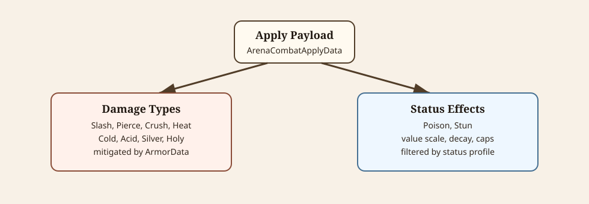

# Damage Types

This document owns instant combat damage channels, damage entries, armor mitigation, immunity, vulnerabilities, and damage icons. Status effects are documented separately in [status-effects.md](status-effects.md).



<details>
<summary>Diagram source notes</summary>

The SVG at [combat-payloads.svg](diagrams/combat-payloads.svg) shows the two parallel payload families: instant damage through `CombatDamageData` and armor, and status effects through status applications and combatant status profiles.

</details>

## Damage Data

Instant damage uses `CombatDamageData`, which contains typed `CombatDamageEntryData` rows.

```text
CombatDamageData
  Entries

CombatDamageEntryData
  Type
  Damage
```

Each entry resolves independently against target armor and immunity rules.

## Current Damage Types

`CombatDamageType` currently includes:

| Type | Common use |
| --- | --- |
| `Slash` | Swords, axes, blades, claws. |
| `Pierce` | Spears, arrows, daggers, bolts. |
| `Crush` | Hammers, clubs, impacts, explosions. |
| `Heat` | Fire, explosions, demons, future fire effects. |
| `Cold` | Frost, ice, future cold effects. |
| `Acid` | Poison flask clouds, corrosive effects, slime/monster fantasies. |
| `Silver` | Special anti-monster or future fantasy damage. |
| `Holy` | Special blessed/anti-undead or future fantasy damage. |

Enemy family identity and champion identity are metadata, not damage types.

## Armor

`ArmorData` controls mitigation:

```text
ArmorData
  BaseValue
  TypeOverrides
  ImmuneTypes
```

Resolution uses:

- `BaseValue` unless a matching `ArmorTypeOverrideData` exists
- positive armor for non-linear mitigation
- zero armor for unchanged damage
- negative armor as vulnerability
- `ImmuneTypes` to ignore listed damage types completely

Positive armor mitigation uses this shape:

```text
damage * (damage / (damage + armor))
```

Negative armor increases damage by the absolute percent value.

## Block Armor

Block defense reuses `ArmorData`. Hand items author `DamageItemData.BlockArmorProfile`, and enemy mobs author `EnemyMobData.BlockArmorProfile`.

At runtime, `ArenaCombatState` resolves effective armor like this:

```text
if combatant state is Blocking:
  effective armor = ArmorProfile + all BlockArmorProfiles
else:
  effective armor = ArmorProfile
```

The addition happens per damage type. A block profile with `BaseValue = 0` and only `Slash`/`Pierce` overrides helps only against those types. Shield block profiles use broad base values so they help against every damage type.

Use `ArenaCombatState.GetEffectiveArmorValue(type, includeBlockArmor)` or `GetMitigatedDamage(damage, includeBlockArmor)` for runtime state-aware calculations.

## Type Overrides

Use `ArmorTypeOverrideData` to make armor or mobs distinct.

Examples:

- mail resists `Slash` but is weaker to `Crush`
- skeletons resist `Pierce` but are vulnerable to `Crush`
- demons are immune or resistant to `Heat`
- fireproof armor resists `Heat`

Prefer type overrides over immunity when the target should resist but not completely ignore a type.

## Immunity

`ArmorData.ImmuneTypes` ignores listed damage types completely.

Use immunity carefully because it is stronger than high armor.

Godot resource defaults currently matter: new armor profiles can default to `Silver` and `Holy` immunity unless a resource explicitly authors a different array.

## Source Item Damage

`ArenaCombatApplyData` can resolve damage from the source item:

```text
UseSourceItemDamage == true and source item has Damage
  -> use source item DamageItemData.Damage
else
  -> use Apply.Damage
```

Normal weapon hits usually use source item damage. Explosions, poison clouds, fire patches, mob attacks, and sandbox tests usually author damage directly on the effect payload.

## Icons

Instant damage icons live under:

```text
assets/ui/combat/instant/type_*.svg
```

Add a matching icon when adding a new `CombatDamageType`.

## Authoring Guidance

- Use physical types for normal weapons: `Slash`, `Pierce`, `Crush`.
- Use `Heat`, `Cold`, and `Acid` only when the fantasy calls for it.
- Do not make elemental damage generic item-tier filler.
- Split damage entries only when separate mitigation is intended.
- Use block armor type overrides for narrow blocking tools such as daggers.
- Check armor immunities whenever creating or duplicating armor/mob resources.
