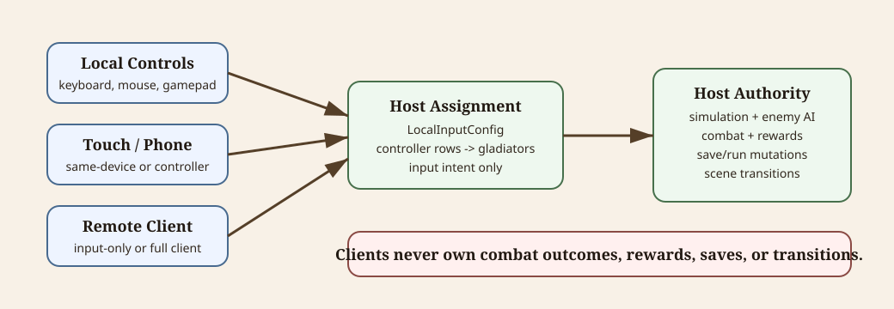

# Input And Multiplayer Control Plan

This document records the planned input direction for local controls, same-device touch controls, remote input-only devices, and multiplayer clients.

For current arena input implementation details, see [arena-combat.md](arena-combat.md).

Diagram source notes

The SVG at [input-authority-model.svg](diagrams/input-authority-model.svg) shows local controls, touch/phone controls, and remote clients feeding input intent into the same host-side assignment path. The host owns simulation, combat, save/run mutation, rewards, and transitions.

## Goal

Support the same core game actions across multiple device modes:

- Local keyboard and mouse.
- Local keyboard-only.
- Local gamepad.
- Same-device touch controls.
- Remote input-only device acting as a gamepad.
- Full multiplayer client that renders the game and sends player input.

Any supported device class should be able to join as a full multiplayer client when it can run/render the game, or as an input-only controller when it should behave like a gamepad for another host display.

## Core Actions

Keep the first action set small and consistent.

Arena actions:

- Move.
- Aim or face direction.
- Main attack.
- Off-hand action.
- Block.
- Ability.
- Confirm/interact.
- Cancel/back.
- Pause/menu.

Menu and town actions:

- Navigate focus or pointer.
- Confirm/interact.
- Cancel/back.
- Open settings/menu.
- Drag/drop where supported.

Movement-only control must remain valid. If a control mode has no independent aim input, movement direction should supply facing and action direction.

## Default Control Mapping Direction

Keyboard and mouse:

- WASD or arrow keys: move.
- Mouse position: optional aim/facing.
- Mouse left: main attack.
- Mouse right: off-hand action.
- Keyboard `Q` or `Space`: block.
- Keyboard `E` or `F`: ability or interact depending on context.
- Enter: confirm.
- Escape or Backspace: cancel/back.

Keyboard-only:

- WASD or arrow keys: move and face.
- Primary action key: main attack.
- Secondary action key: off-hand action.
- Block key.
- Ability key.
- Enter: confirm.
- Escape or Backspace: cancel/back.

Gamepad:

- Left stick or D-pad: move.
- Right stick or right mousepad-style input: optional aim/facing.
- Face button or trigger: main attack.
- Face button or trigger: off-hand action.
- Face button or shoulder: block.
- Face button or shoulder: ability.
- South button: confirm/interact.
- East button: cancel/back.

Same-device touch:

- Virtual stick or drag zone: move.
- Optional aim drag or target direction: aim/facing.
- Large touch buttons: main attack, off-hand action, block, ability.
- Large touch buttons: confirm and cancel.

Remote input-only device:

- Use the same action names as gamepad, regardless of whether the remote UI is touch, browser buttons, or another controller.
- Send input intent to the host; do not send gameplay outcomes.

Exact button labels can change during implementation, but every control mode should map cleanly to the same action names.

## Device Modes

Full multiplayer client:

- Runs enough of the game client to render host state and local UI.
- Sends player input to the host.
- Receives authoritative state, events, and corrections from the host.

Input-only client:

- Runs a minimal controller UI or hardware-controller bridge.
- Sends only input messages to the host.
- Does not load full game scenes, save data, contract resources, combat simulation, or economy systems.
- Is intended for phone-as-gamepad and couch co-op use.

Same physical device type can support either mode. For example, a phone can be a full multiplayer client or a remote gamepad, depending on the selected join mode.

## Authority Model

Use a host-authoritative model.

The host/server owns:

- Enemy AI and behavior decisions.
- Authoritative player and enemy positions.
- Combat hit resolution.
- Health, stamina, death, victory, defeat, and forfeit results.
- Rewards, fame, XP, economy mutations, and save/run state.
- Contract result resolution.
- Scene transitions.

Clients own:

- Local input collection.
- Local UI presentation.
- Rendering host state.
- Optional prediction, interpolation, and cosmetic feedback for responsiveness.

Input-only clients own only input capture. They must not own simulation, save data, combat resolution, economy mutations, or scene transitions.

## Remote Transport Options

Support should be designed around two local-connection paths first.

Wi-Fi / IP session:

- Host opens a local session on a configured or discovered port.
- Clients join through LAN discovery, direct IP, room code, or QR code.
- This is the likely first path for phone-as-gamepad and local multiplayer clients because it works across phones, tablets, laptops, and browser-based controller UIs.
- The host should display the active address, port, room code, or QR code in the join UI.

Bluetooth communication:

- Bluetooth can support nearby controller-style clients where platform APIs allow it.
- Treat Bluetooth as another transport for the same input protocol instead of a separate gameplay path.
- Expect more platform-specific implementation and permission friction than Wi-Fi.
- Prefer a small proof of concept before depending on Bluetooth for the main flow.

Both transports should feed the same host-side remote input abstraction once a client is paired.

## Input Protocol Shape

The first version should keep the protocol small and action-oriented. Remote clients should send intent, not gameplay outcomes.

Useful message fields:

- Client id.
- Assigned controller id or slot.
- Device mode: full client or input-only client.
- Transport type: local, Wi-Fi/IP, Bluetooth, or future transport.
- Movement vector.
- Optional aim/facing vector.
- Main attack pressed/released.
- Off-hand action pressed/released.
- Block pressed/released.
- Ability pressed/released.
- Confirm/cancel/menu actions.
- Heartbeat and disconnect messages.

The host translates these messages into the same control assignment path used by local Keyboard, Mouse, Touch, and Gamepad rows.

## Assignment Flow

Remote clients should integrate with the arena launch control setup flow instead of bypassing it.

Expected behavior:

- Host creates or exposes a join session.
- Remote device chooses full-client mode or input-only gamepad mode.
- Remote device joins through Wi-Fi/IP or Bluetooth pairing.
- Host shows the remote device as a joinable controller/player row.
- Player assigns that remote row to an arena gladiator.
- Gameplay scenes query the existing controller assignment source of truth instead of special-casing remote devices.

## Reliability And Safety

Handle these cases deliberately:

- Duplicate client ids.
- Disconnect during control setup.
- Disconnect during combat.
- Reconnect and reassignment.
- Missing heartbeat timeout.
- Host ending the session.
- Client sending input before assignment.
- Client sending invalid or impossible input values.
- Transport change or fallback between Wi-Fi/IP and Bluetooth.

Invalid remote input should be ignored or clamped by the host. It should never mutate run state directly.

## First Vertical Slice

Start with the smallest useful path:

1. One host.
2. One remote input-only client over Wi-Fi/IP.
3. Join through a simple explicit address, room code, or QR code.
4. Remote client appears in arena control setup.
5. Remote client controls one arena gladiator movement and main action.
6. Host owns combat state and broadcasts authoritative positions/results.
7. Disconnect safely clears or disables the assigned remote controller.

Bluetooth and full multiplayer rendering can follow once the host-side input abstraction is proven.

Do not start by implementing full online matchmaking, rollback networking, or client-owned enemy/combat logic.

## Non-Goals For First Pass

- Client-authoritative enemy AI.
- Client-authoritative combat hits, deaths, rewards, or save changes.
- Full online matchmaking service.
- Complex account/auth flow beyond minimal local join/pairing.
- Replacing same-device touch controls tracked separately.
