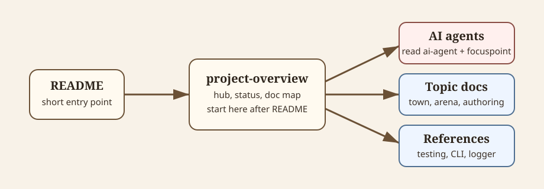

# Project Overview

MobArena is a Godot 4.6 C# prototype for a 2D top-down gladiator arena game. The player manages a gladiator company in town, accepts arena contracts, and controls assigned gladiators in direct arena combat.

This file is the documentation hub. Keep it readable and link to topic docs instead of duplicating their details.



<details>
<summary>Diagram source notes</summary>

The SVG at [docs-reading-flow.svg](diagrams/docs-reading-flow.svg) shows the intended reading path: [README.md](../README.md) points to this overview, then this overview points AI agents to [ai-agent.md](ai-agent.md), [focuspoint.md](focuspoint.md), and the relevant topic docs.

</details>

## Read This First

If you are an AI agent, read [ai-agent.md](ai-agent.md), [focuspoint.md](focuspoint.md), and the relevant topic docs in the documentation map before changing code, scenes, resources, or docs.

For current implementation work, treat [focuspoint.md](focuspoint.md) as the active session handoff and [roadmap.md](roadmap.md) as post-MVP direction.

## Current Status

| Area | Status |
| --- | --- |
| Engine | Godot 4.6 C# with GL Compatibility rendering and Jolt Physics. |
| Main flow | `Main Menu -> Town -> Arena`. |
| Town | Roster management, drag/drop, Market, Recovery Bay, Training Hall, contracts, control setup, phase work, weather, and champion cadence are implemented at prototype level. |
| Arena | Assigned players and contract enemies spawn; runtime combat state, player actions, combat HUD, victory, defeat, forfeit, and result resolution exist at first-pass level. |
| Combat actions | Resource-driven melee, linear projectile, thrown projectile, and area-of-effect executors exist. |
| Enemy behavior | Enemy resources, families, contracts, spawning, and health exist; family-specific enemy AI and attacks are not implemented yet. |
| Input | Keyboard, mouse, and gamepad arena input exist. Touch can join control setup but does not drive arena combat yet. |
| Save data | `SaveNode` persists company, run, career, phase, weather, settings, and completed-company history resources under `user://save`. |

## Game Flow

1. Main menu creates or loads a company.
2. Town handles recruitment, gear, assignments, treatment, training, contracts, phase work, and onboarding gates.
3. Arena launches from town with an active contract, assigned gladiators, and per-contract control assignments.
4. Arena resolves win, loss, forfeit, champion retirement, demo completion, and return-to-town/main-menu transitions.
5. Night/Day phase advancement resolves building work, salaries, market refresh, weather changes, and champion cadence.

## Architecture Snapshot

Durable architecture boundaries live in [architecture.md](architecture.md).

Short version:

- Autoloads provide global services: `GlobalOverlay`, `SaveNode`, `RuntimeTagOverlay`, and `LocalInputConfig`.
- Scenes own presentation, signals, and scene flow, not long-term game data.
- Godot `Resource` classes under `scripts/resources/` own data and most mutation APIs.
- Authored `.tres` resources under `resources/` are the source of truth for items, mobs, contracts, appearances, combat profiles, and combat actions.
- Arena combat effects target `ArenaCombatant.ApplyDamage(...)` and do not mutate save/run data directly.
- Phase changes go through `PhaseTransitionController`.
- Modal UI goes through `GlobalOverlay`.

## Documentation Map

| File | Purpose |
| --- | --- |
| [ai-agent.md](ai-agent.md) | Required implementation rules and constraints for AI agents and developers. |
| [focuspoint.md](focuspoint.md) | Current active priority, handoff state, and immediate next work. |
| [roadmap.md](roadmap.md) | Post-MVP direction and intentionally deferred systems. |
| [architecture.md](architecture.md) | Runtime boundaries, ownership rules, and major system relationships. |
| [source-layout.md](source-layout.md) | Folder map and where new files should live. |
| [testing.md](testing.md) | Validation commands, manual test scenes, and sandbox workflows. |
| [game-design.md](game-design.md) | Game concept, design pillars, economy, combat direction, and prototype scope. |
| [town-management.md](town-management.md) | Town scene, RosterYard, drag/drop, buildings, market, treatment, training, contracts, and phase work. |
| [arena-combat.md](arena-combat.md) | Arena scene runtime, spawners, combatants, player input, HUD, victory, defeat, and current combat limits. |
| [arena-combat-actions.md](arena-combat-actions.md) | Resource-driven action/effect architecture and runtime executors. |
| [damage-types.md](damage-types.md) | Instant damage types, damage entries, armor mitigation, immunity, and damage icons. |
| [status-effects.md](status-effects.md) | Poison, stun, status value scale, effect defense, status profiles, and status icons. |
| [input.md](input.md) | Local input, remote input-only devices, host-authoritative multiplayer direction. |
| [authoring-attacks.md](authoring-attacks.md) | Practical guide for authoring attack/action/effect resources. |
| [authoring-player-items.md](authoring-player-items.md) | Practical guide for authoring weapons, off-hand items, armor, visuals, coatings, and item actions. |
| [authoring-mobs.md](authoring-mobs.md) | Practical guide for authoring mobs, appearances, families, fame, armor, status profiles, and future scenes. |
| [save-data.md](save-data.md) | Save files, runtime resources, company run/career split, settings, weather, history, and retirement. |
| [cli-commands.md](cli-commands.md) | Headless save-data and run-mutation command reference. |
| [game-logger.md](game-logger.md) | `GameLogger` API, categories, message style, and extension rules. |

## Source Layout

See [source-layout.md](source-layout.md) for the full folder map.

Core paths:

| Path | Purpose |
| --- | --- |
| `project.godot` | Godot project settings and autoload registration. |
| `autoload/` | Global runtime nodes. |
| `scripts/resources/` | Resource classes, data models, and mutation APIs. |
| `scenes/` | Main scenes, overlays, and reusable scene components. |
| `resources/` | Authored gameplay `.tres` resources. |
| `assets/` | Runtime art, UI icons, fonts, and shaders. |
| [diagrams/](diagrams/) | Documentation-only SVG diagrams. |
| `tests/` | Manual test scenes and sandbox resources. |

## Current Boundaries

- The arena has first-pass combat/result flow, but enemy AI and family-specific behavior scenes are still future work.
- Player main-hand and off-hand actions activate item-authored actions. Block and ability inputs are read but do not activate authored gameplay actions yet.
- Touch control setup exists, but touch combat input is not implemented yet.
- Item requirements, level multipliers, coatings, weight, and durability are authored data, but several of their gameplay effects are not enforced yet.
- Market item stock still uses a debug catalog path list instead of progression-aware generation.
- Dedicated Recovery Bay and Training Hall room scenes are post-MVP roadmap work; current town uses building objects and overlays.

## Validation

Use [testing.md](testing.md) as the source of truth for validation workflows.

Common commands:

```bash
godot --headless --import
dotnet build
godot --headless --quit
```
