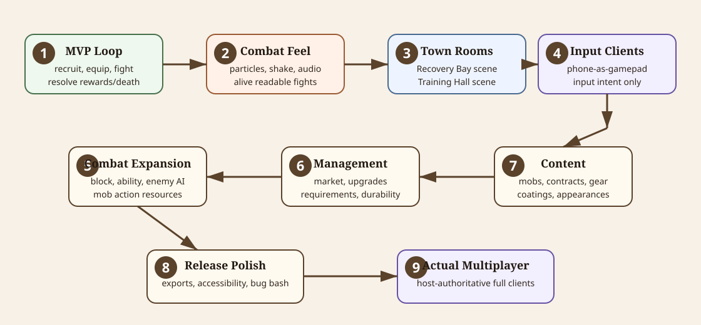
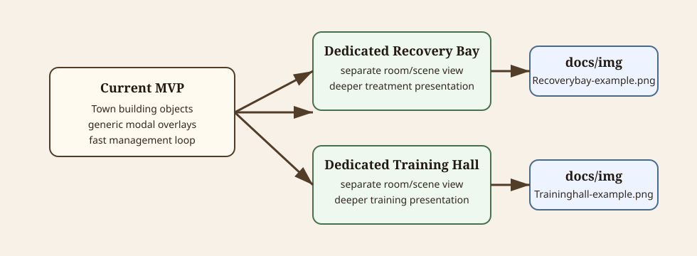
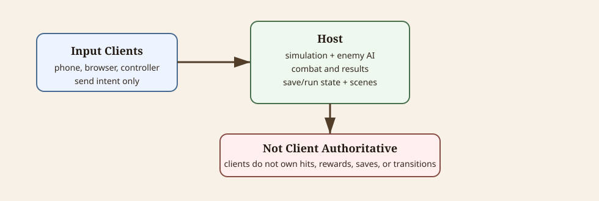

# Roadmap

This document captures future direction, mostly after the MVP loop is playable. It should not replace [focuspoint.md](focuspoint.md), which owns the current immediate handoff and next work.

## Purpose

Use this roadmap to preserve larger deferred intentions so short-term docs can stay focused and factual.

Diagram source notes

The SVG at [roadmap-root-features.svg](diagrams/roadmap-root-features.svg) shows the root planned feature tracks as a numbered roadmap: MVP loop, combat feel, dedicated town rooms, input-only clients, combat expansion, management expansion, content expansion, release polish, and actual multiplayer.

## MVP Boundary

The MVP should prioritize a working arena-first loop:

- recruit gladiators
- buy/equip basic gear
- select contracts
- control assigned gladiators in arena
- fight basic enemies
- resolve victory, defeat, death, rewards, and return to town
- survive early economy and champion pressure

Do not block MVP on richer town rooms, full multiplayer, advanced AI, or release polish.

## First Post-MVP Priority: Combat Feel And Polish

The first post-MVP priority should be making arena combat feel alive, readable, and satisfying after the basic loop works.

This includes:

- hit sparks, impact bursts, dust, blood/ooze, and other small particle effects
- screen shake and camera impulse for strong hits, landings, deaths, and champion moments
- hit stop or brief time emphasis where it improves clarity without hurting control
- improved attack trails, projectile visuals, thrown-object arcs, landing effects, and AOE presence
- stronger enemy death feedback and cleanup effects
- clearer player damage feedback, low-health feedback, and status feedback
- audio hooks for attacks, impacts, UI, crowd/arena ambience, phase changes, and victory/defeat
- better combat HUD readability for health, stamina, status, enemies remaining, and objective state
- animation polish for body facing, hands, held items, recoil, release, and recovery

Keep polish reusable. Prefer small effect scenes, particles, camera helpers, and authored hooks that can be reused by item actions, mob attacks, and arena result moments instead of one-off code in `PlayerCombatant` or `EnemyCombatant`.

## Post-MVP Town Building Scenes

Current MVP town management uses town building objects and modal overlays for Recovery Bay and Training Hall.

Post-MVP direction: make Recovery Bay and Training Hall richer dedicated room/scene views instead of only objects in the town grid.

Diagram source notes

The SVG at [roadmap-town-building-scenes.svg](diagrams/roadmap-town-building-scenes.svg) shows the current MVP building-object/overlay approach evolving into dedicated Recovery Bay and Training Hall scenes. The visual references are [Recoverybay-example.png](img/Recoverybay-example.png) and [Traininghall-example.png](img/Traininghall-example.png).

Reference images:

| Future scene | Reference image |
| --- | --- |
| Dedicated Recovery Bay | [Recoverybay-example.png](img/Recoverybay-example.png) |
| Dedicated Training Hall | [Traininghall-example.png](img/Traininghall-example.png) |

These images are layout/feel references for future scene work, not a requirement to implement before MVP.

## Post-MVP Multiplayer And Input-Only Clients

Long-term multiplayer should follow the host-authoritative direction in [input.md](input.md).

Diagram source notes

The SVG at [roadmap-multiplayer-input.svg](diagrams/roadmap-multiplayer-input.svg) shows phones, browser clients, and remote controllers sending input intent only. The host owns simulation, enemy AI, combat resolution, rewards, save/run mutations, and scene transitions.

Direction:

- clients and phones-as-gamepads send input intent only
- input-only clients do not load save data or own combat outcomes
- full clients render host state and send input
- host owns simulation, enemy AI, damage, death, rewards, run state, save state, and transitions
- Wi-Fi/IP should be the first practical transport path
- Bluetooth can be a later transport feeding the same input abstraction

## Combat Expansion

Post-MVP combat work:

- add player block activation from existing block input
- add player ability activation from existing ability input
- add dodge if it remains part of the action set
- add family-specific enemy behavior scenes using child movement, attack, and logic components
- add enemy-authored attacks through the same action/effect system
- improve combat HUD and feedback
- add projectile wall behavior where useful
- tune stamina, windup, release, buildup, status, and damage values through playtesting

## Management Expansion

Post-MVP management work:

- curated/progression-aware market stock generation
- deeper building upgrades
- richer Recovery Bay and Training Hall scenes
- clearer treatment/training result previews
- better company history and records presentation
- longer-run economy balancing
- undertrained-item penalties from item requirements
- durability and coating consumption behavior

## Content Expansion

Post-MVP content work:

- more enemy behavior families
- more contracts and champion variants
- more item action patterns
- more coatings and status/damage fantasies
- more gladiator appearances
- richer town visuals and room art

## Release And Polish

Later release work:

- export presets
- demo/release checklist
- accessibility and input polish
- controller/touch UI polish
- balance pass
- bug bash
- release tagging

## Final Long-Term Goal: Actual Multiplayer

The final major roadmap goal is to make MobArena actually multiplayer after the local loop, combat feel, management systems, content, and release polish are stable.

This is separate from the earlier input-only client goal. Input-only clients and phones-as-gamepads should prove the host-side input abstraction first. Full multiplayer comes later.

Actual multiplayer should still follow the host-authoritative model in [input.md](input.md):

- clients send input, not outcomes
- host owns combat simulation and enemy AI
- host owns rewards, deaths, economy, save/run mutations, and scene transitions
- clients render authoritative state and local UI
- prediction/interpolation can be added for responsiveness only after correctness is stable

Do not start with online matchmaking, rollback, accounts, or client-authoritative combat. Build from local/hosted sessions and the already-proven input assignment flow.

## Not Now

Avoid starting these before the MVP loop is strong:

- full online matchmaking
- client-authoritative combat
- rollback networking
- complex account/auth systems
- large town-room rewrites before arena combat is playable
- extensive balance documents before combat and economy behavior stabilizes
