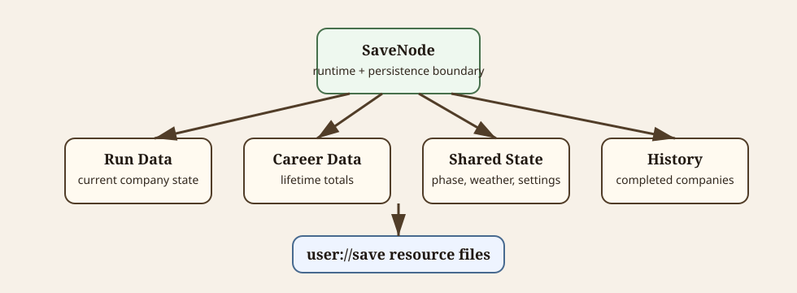

# Save Data

This document owns persistence and runtime save-state boundaries. CLI commands are documented in [cli-commands.md](cli-commands.md).

Diagram source notes

The SVG at [save-data-flow.svg](diagrams/save-data-flow.svg) shows `SaveNode` as the persistence boundary for current run data, career data, shared state, completed company history, and files under `user://save`.

## SaveNode Boundary

`SaveNode` is an autoload and the runtime holder for save-backed resources.

It owns:

- loading save resources
- saving save resources
- deleting save data
- resetting runtime state
- starting new company runs
- force-retiring companies
- exposing shared runtime resources to scenes

Gameplay mutation helpers should usually live on domain resources such as `CompanyRunData`, not on `SaveNode`.

## Saved Resources

Save data is stored under `user://save`.

Current saved resource areas:

| Resource | Purpose |
| --- | --- |
| manifest | Tracks whether an active company exists. |
| company logo | Current company identity. |
| company career | Lifetime totals for the current company. |
| company run | Current mutable company state. |
| town phase | Current day, phase, and champion cadence state. |
| weather | Shared current weather. |
| settings | Settings such as dev/demo/tutorial/deadzone/runtime tags. |
| completed company history | Fame-sorted completed company records. |

When no active company exists, active company files are removed while settings and completed company history can remain.

## CompanyRunData

`CompanyRunData` owns current mutable run state:

- current gold and fame
- active gladiators
- cemetery
- inventory
- market stock
- town assignments
- arena control assignments
- active arena contract
- pending death notifications
- tutorial/onboarding flags
- building upgrade levels
- current run mob kills

Use run-data APIs for mutation. Examples include `AddGold`, `TrySpendGold`, `SpendGoldAllowDebt`, `AddFame`, `LoseFame`, `TryBuyMarketItem`, `TryBuyMarketGladiator`, `TrySellItem`, `TrySellGladiator`, `TryEquipItemOnGladiator`, and `KillGladiator`.

## CompanyCareerData

`CompanyCareerData` owns additive lifetime totals for the current company.

It should track lifetime facts such as total gladiators, deaths, total gold earned, contracts completed, mobs killed, and champions defeated.

Spending current gold should not subtract from lifetime earned gold.

## Completed Company History

Completed company records live in `CompletedCompanyHistory`.

Records store summary identity and career data, not full `CompanyRunData` snapshots. Force-retirement and end-of-run flows should call `SaveNode.TryAddCurrentCompanyToCompletedHistory()` so qualification, sorting, and caps stay centralized.

## Force Retirement

Champion loss can force-retire the active company.

Force retirement:

- snapshots the current company into completed history if it qualifies
- clears active company/run state
- clears local input assignments
- saves
- returns to main menu through arena result flow

## Settings, Weather, And Phase

Settings, weather, and phase are save-backed resources exposed from `SaveNode`.

- `SettingsConfig` stores dev mode, demo mode, runtime tags, tutorial skip, low-health warning ratio, arena move deadzone, and arena auto-assign count.
- `WeatherState` stores the current shared weather. Default weather is `Cloudy`.
- `TownPhaseState` stores day and Day/Night phase. Every seventh day is Champion Day.

## Autosave

Autosave should stay deliberate and lightweight.

Current save triggers include company create/edit, app exit, leaving town to main menu, returning from arena, and advancing Night -> Day.

CLI operations can suppress exit autosave when needed.
