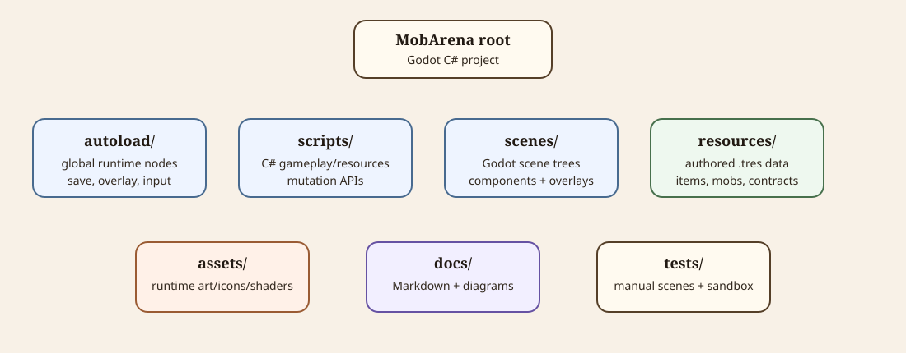

# Source Layout

This document maps the repository layout and where new files should usually live.

Diagram source notes

The SVG at [source-layout-map.svg](diagrams/source-layout-map.svg) gives a quick repository map for the major folders: autoloads, scripts, scenes, resources, assets, docs, and tests.

## Root

| Path | Owns |
| --- | --- |
| [README.md](../README.md) | Short project entry point. |
| `project.godot` | Godot project settings, main scene, autoload registration, renderer, physics settings. |
| `MobArena.csproj` | Godot C# project file. |
| `.github/workflows/dotnet.yml` | GitHub Actions .NET restore/build/test workflow. |
| `.godot/` | Ignored local Godot editor/import cache. Not source of truth. |

## Code

| Path | Owns |
| --- | --- |
| `autoload/` | Global autoload scenes/scripts such as `SaveNode`, `GlobalOverlay`, runtime tags, and local input config. |
| `scripts/` | Root scene scripts and shared code. |
| `scripts/resources/` | Godot `Resource` classes, resource data models, resource catalogs, and run-state mutation APIs. |
| `scripts/resources/combat/` | Damage data, combat state, action resources, and effect payload resources. |
| `scripts/resources/items/` | Item, equipment, armor, coating, requirement, multiplier, and armor data resources. |
| `scripts/resources/mobs/` | Mob data, family data, appearances, and family catalog code. |
| `scripts/resources/contracts/` | Contract data, selection, generation, and result resolution. |
| `scripts/resources/market/` | Market stock generation and item catalog code. |
| `scripts/ui/` | Shared UI input helper code. |
| `scripts/utils/` | Small shared utility classes. |

## Scenes

| Path | Owns |
| --- | --- |
| `scenes/main_menu.tscn` | Main menu scene. |
| `scenes/town.tscn` | Town management scene. |
| `scenes/arena.tscn` | Arena combat scene. |
| `scenes/components/` | Reusable scene components. |
| `scenes/components/town/` | Town buildings, RosterYard, drag/drop payloads, town drag targets. |
| `scenes/components/arena/` | Combatants, spawners, camera, combat HUD, and reusable combat effect scenes. |
| `scenes/components/ui/` | Shared UI cards, icons, stat rows, HUD pieces, item showcases. |
| `scenes/components/panels/` | Reusable popup and building panel components. |
| `scenes/components/environment/` | Shared town/arena environment visual overlay and weather shader layer. |
| `scenes/town_overlays/` | Town-specific overlays such as market, contracts, control setup, next-day summary. |
| `scenes/ui/` | General overlays such as codex, settings, records, inventory, company overview. |

## Authored Resources

| Path | Owns |
| --- | --- |
| `resources/items/main_hand/` | Main-hand weapon item `.tres` resources. |
| `resources/items/off_hand/` | Off-hand weapon/tool/shield item `.tres` resources. |
| `resources/items/armor/` | Armor item `.tres` resources. |
| `resources/coatings/` | Item coating `.tres` resources. |
| `resources/mobs/` | Individual enemy and champion mob `.tres` resources. |
| `resources/mob_families/` | Enemy family roots used by contracts and codex. |
| `resources/mob_appearances/` | Mob UI/world appearance resources. |
| `resources/gladiator_appearances/` | Gladiator appearance resources. |
| `resources/contracts/` | Authored contract examples/fallbacks. |
| `resources/combat/status_profiles/` | Default and special combatant status profiles. |
| `resources/combat/player_defaults/` | Hidden fallback unarmed player action items. |

## Assets

| Path | Owns |
| --- | --- |
| `assets/ui/` | Runtime UI icons, item icons, combat icons, input icons, company logo art. |
| `assets/mobs/` | Mob body/hand world art. |
| `assets/gladiators/` | Gladiator body/hand world art. |
| `assets/town/` | Town building/world art. |
| `assets/shaders/` | Runtime shaders, including weather and popup blur shaders. |
| `assets/fonts/` | Imported fonts and font resources. |

## Documentation

| Path | Owns |
| --- | --- |
| `docs/*.md` | Documentation topic files. Start with [project-overview.md](project-overview.md). |
| [diagrams/](diagrams/) | Documentation-only SVG diagrams. These are not game runtime assets. |
| [img/](img/) | Documentation/reference images such as future Recovery Bay and Training Hall layout references. |

## Tests And Sandboxes

| Path | Owns |
| --- | --- |
| `tests/test_mob_fight.tscn` | Manual preplaced combat room. |
| `tests/attack_effect_sandbox.tscn` | Manual action/effect sandbox scene. |
| `tests/attacks/` | Sandbox `ArenaCombatActionData` resources covering melee, projectile, thrown, AOE, and chain cases. |
