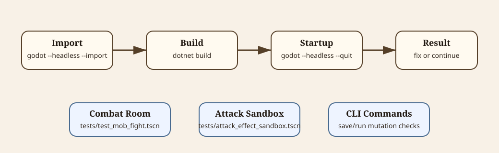

# Testing And Validation

This document centralizes validation commands and manual testing workflows.



<details>
<summary>Diagram source notes</summary>

The SVG at [testing-workflow.svg](diagrams/testing-workflow.svg) shows the standard validation chain plus the main manual test paths: combat room, attack/effect sandbox, and CLI save/run mutation checks.

</details>

## Standard Validation

Run these from the project root after changing C# code, scenes, resources, imported assets, or project settings:

```bash
godot --headless --import
dotnet build
godot --headless --quit
```

What each command catches:

| Command | Purpose |
| --- | --- |
| `godot --headless --import` | Reimports assets/resources and catches many broken Godot resource references. |
| `dotnet build` | Compiles the C# project. |
| `godot --headless --quit` | Starts the project headlessly and catches startup/load errors. |

On Linux with multiple .NET SDKs installed, Godot Mono can ignore `global.json` during editor/import startup and pick a newer host runtime. If `godot --headless --import --quit` crashes while unloading after import, run Godot through the local .NET 8 wrapper:

```bash
tools/godot-dotnet8.sh --headless --import --quit
tools/godot-dotnet8.sh --headless --quit
```

The wrapper creates a temporary isolated .NET root under `/tmp/opencode/dotnet8-root` from the installed .NET 8 SDK/runtime and runs Godot with `DOTNET_ROOT` and `DOTNET_MULTILEVEL_LOOKUP=0`.

If Godot tries to open a deleted or renamed scene from local editor state, reset local generated cache and import again:

```bash
rm -rf .godot
godot --headless --import
```

`.godot/` is ignored local state and is regenerated by Godot.

## Manual Arena Test Scene

Run the preplaced combat test room with:

```bash
godot tests/test_mob_fight.tscn
```

Run a headless load check with:

```bash
godot --headless tests/test_mob_fight.tscn --quit
```

## Attack/Effect Sandbox

Run the action/effect sandbox with:

```bash
godot tests/attack_effect_sandbox.tscn
```

The sandbox loads `tests/attacks/**/*.tres` into a dropdown. Select an attack, move the mouse over the arena, and press `F` to spawn it at the mouse position facing right.

Buildup attacks use `F` once to charge and `F` again to release.

Use the sandbox to verify:

- melee hit size, active time, damage, force, and status
- linear projectile speed, range, hitbox, penetration, and chained effects
- thrown projectile arc, range scaling, landing effects, and visuals
- AOE radius, tick cadence, max hits, status application, and chains
- runtime combat logs

## CLI Save/Run Validation

Headless command-line mutation helpers are documented in [cli-commands.md](cli-commands.md).

Example command sequence:

```bash
godot --headless -- --delete --generate-company --add-money=250 --buy-equipment=1 --generate-gladiator --complete-contract --next-day
```

Use CLI commands when you need to check save-data paths, run mutation, contract completion, market purchase paths, weather setting, or scene resource load checks.

## Documentation-Only Changes

Documentation-only edits do not require Godot import/build validation, but `dotnet build` is still a cheap sanity check if code snippets or file paths were updated alongside code changes.
