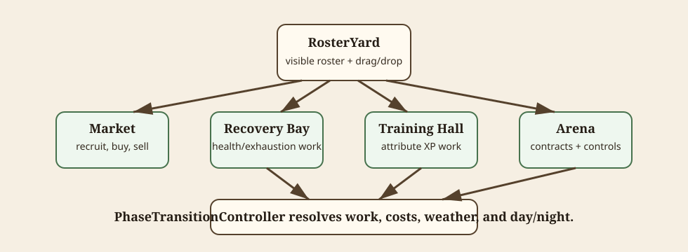

# Town Management

This document owns the current town implementation. Design direction belongs in [game-design.md](game-design.md); post-MVP town expansion belongs in [roadmap.md](roadmap.md).

Diagram source notes

The SVG at [town-management-flow.svg](diagrams/town-management-flow.svg) shows `RosterYard` as the central town surface, with drag/drop and overlays feeding Market, Recovery Bay, Training Hall, Arena, and phase work.

## Scene Structure

`scenes/town.tscn` uses a neutral root with a world layer and UI layers. Town world objects live under `World`; the reusable town HUD is `TownHud.tscn`.

The current town layout is an implied-road building layout with the central `RosterYard` management surface. Building objects are authored in scene files and open modal overlays through `GlobalOverlay`.

## Town Buildings

Town buildings use `scenes/components/town/TownBuilding.tscn`.

Current buildings:

| Building | Current role |
| --- | --- |
| Arena / Contract Board | Assign gladiators, select contracts, configure controls, and launch arena. |
| Market | Recruit gladiators, buy items/coatings, sell dropped gladiators/items. |
| Recovery Bay | Assign gladiators for health or exhaustion treatment during phase work. |
| Training Hall | Assign gladiators for focused or general attribute training during phase work. |
| RosterYard | Central visible roster, drag/drop surface, quick buttons for roster/equipment/gold. |

Buildings can be disabled when the roster is empty, disabled at night, hidden by tutorial gates, or assigned a closed-state texture.

## RosterYard

`RosterYard` displays courtyard gladiators from `CompanyRunData.TownAssignments.CourtyardGladiators`.

It owns the current town drag/drop flow:

- gladiators can be dragged from the courtyard to town buildings
- items can be dragged from inventory to gladiators or Market
- overlapping drop targets use `TownDragDropPriority`
- dragging a gladiator nowhere returns it to the courtyard
- Market sale drops require confirmation before mutation

`RosterYardGladiator` renders body, armor, hands, held items, shadow, name, level, health, exhaustion, equipment, and risk indicators.

## Assignments

Town assignment state belongs to `CompanyRunData.TownAssignments`, not scene-local arrays.

Current assignment locations:

| Location | Purpose |
| --- | --- |
| Courtyard | Visible idle/available roster in RosterYard. |
| Arena | Gladiators assigned to the next arena contract. |
| Recovery Bay | Gladiators assigned to treatment. |
| Training Hall | Gladiators assigned to training. |

Use run-data APIs such as `TryAssignGladiatorToTownLocation`, `TryMoveGladiatorToCourtyard`, and `RemoveGladiatorFromTownAssignments` instead of mutating arrays directly.

## Market

The Market currently opens a hub with gladiator recruitment and item storefront paths.

Market state is saved on `MarketData`, so leaving/reloading does not reroll stock. Stock refreshes on Night -> Day through phase transition work.

Current item stock uses `MarketItemStockGenerator.GenerateDebugAllItems()` and `MarketItemCatalog`. A curated/progression-aware market generator is future work.

The Market building also accepts dropped items and gladiators for sale. Sale mutations call `CompanyRunData.TrySellItem` or `CompanyRunData.TrySellGladiator` after confirmation.

## Recovery Bay

Recovery Bay is currently a town building plus modal overlay.

It supports focus selection:

- health treatment
- exhaustion treatment

Phase work spends gold allowing debt and applies selected treatment to assigned gladiators. Weather can modify treatment costs/effects.

Dedicated Recovery Bay room/scene presentation is post-MVP roadmap work. See [roadmap.md](roadmap.md) and [Recoverybay-example.png](img/Recoverybay-example.png).

## Training Hall

Training Hall is currently a town building plus modal overlay.

It supports focus selection:

- overall
- strength
- agility
- vitality
- endurance

Phase work spends gold, stamina, and exhaustion to add attribute XP. Weather can modify training effect/cost.

Dedicated Training Hall room/scene presentation is post-MVP roadmap work. See [roadmap.md](roadmap.md) and [Traininghall-example.png](img/Traininghall-example.png).

## Contracts And Arena Launch

Arena contract launch is town-side.

Flow:

1. Assign one or more healthy gladiators to Arena.
2. Open contracts from the Arena building or Town HUD.
3. Select a visible contract.
4. Optionally auto-assign 1-4 healthy gladiators.
5. Configure controls in `ArenaControlConfigOverlay`.
6. Review launch summary.
7. Store active contract and change to `scenes/arena.tscn`.

Champion Day contracts cannot be skipped. Non-champion skip flow applies fame loss and moves Day -> Night through `PhaseTransitionController.SkipArenaContract`.

## Phase Work

Town uses explicit Day/Night phases.

Returning from arena moves Day -> Night. Night allows recovery/training planning and the `Next Day` action. Night -> Day resolves salaries, building work, market refresh, weather randomization, and champion cadence.

Phase work must go through `PhaseTransitionController` and run-data APIs, not scene-only UI state.

## Tutorial Gates

Early onboarding gates town complexity:

- new companies start with no gladiators
- Market is the first required step
- Arena is hidden until a gladiator is hired
- before any completed contracts, only the starter slime contract is shown
- Recovery Bay unlocks after the second completed contract
- Training Hall unlocks after the third completed contract
- `SettingsConfig.SkipTutorial` bypasses these gates

Tutorial/prompt flags live on `CompanyRunData`.
